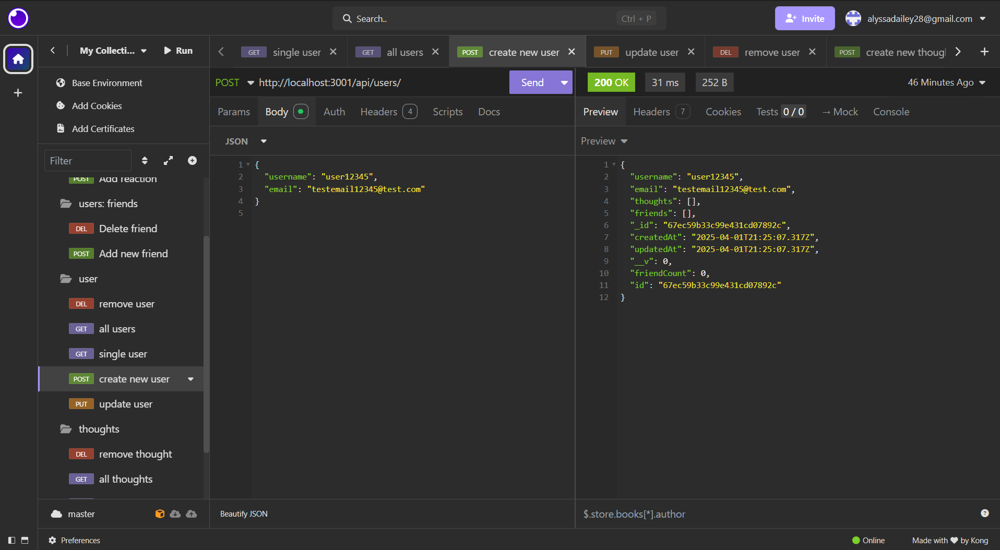
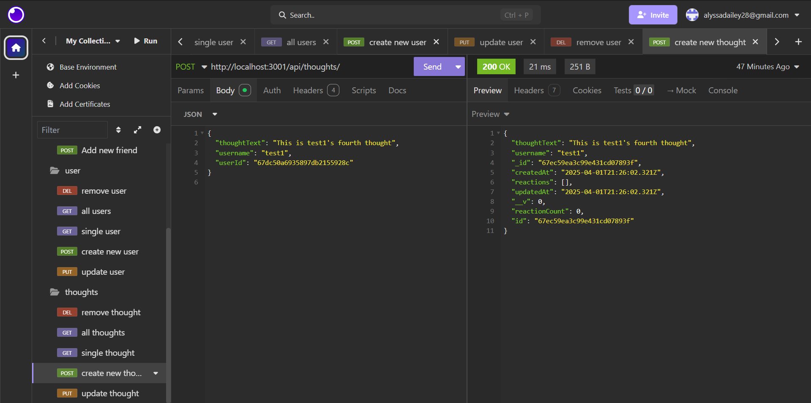
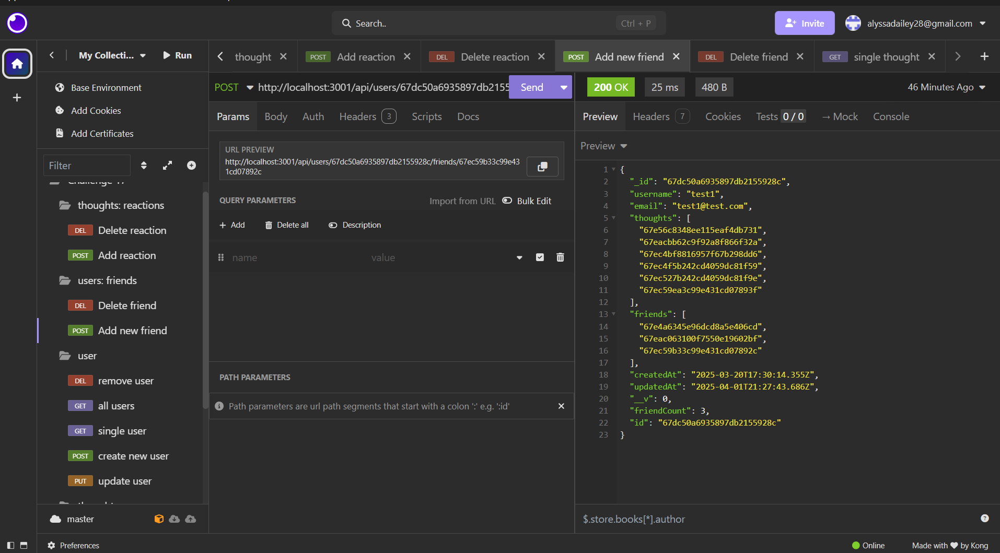

# ThoughtHub

## Table of Contents
- [Description](#description)
- [Screenshots](#screenshots)
- [Installation](#installation)
- [Usage](#usage)
- [Features](#features)
- [License](#license)
- [Contributing](#contributing)
- [Tests](#tests)
- [Credit](#credit)
- [Project Links](#project-links)
- [Questions](#questions)

## Description

ThoughtHub is a backend API that powers a social networking platform where users can create an account, share their thoughts, react to others' thoughts, and manage a list of friends. Built with Node.js, Express, MongoDBCompass, and Mongoose, this project provides a solid foundation for scalable social media applications. The API supports full CRUD operations for users and thoughts connections. Reactions and friend support Create and Delete connections.

## Screenshots

Here are some previews of the webpage:

###  Create a user

### Post a thought

### Add a friend

### React to a Thought

## Installation

1. Clone the repository:

git clone https://github.com/alyssadailey/thoughthub.git

2. Navigate into the project directory:

cd Challenge-17-ThoughtHub

3. Install dependencies:

npm install

4.Start the server:

npm run start:dev

## Usage

1. Create a user by sending a POST request to /api/users.

2. Add friends by sending a PUT request to /api/users/:userId/friends/:friendId.

3. Post thoughts using a POST request to /api/thoughts.

4. React to thoughts with a POST request to /api/thoughts/:thoughtId/reactions.

5. Remove reactions, delete thoughts, or unfriend users using DELETE requests.

## Features

-User Management: Create, update, and delete users.

-Thoughts System: Users can create, edit, and delete thoughts.

-Reactions: Users can react to thoughts with custom messages.

-Friend Connections: Add and remove friends dynamically.

-MongoDB with Mongoose: Efficient NoSQL database handling.

-Express.js API: RESTful API structure for easy integration.

-Insomnia/Postman Support: Test endpoints with ease.

## License

This application is covered under the MIT license.

## Contributing

If you would like to contribute to my project please follow these steps!

1. Fork the repository on GitHub.
2. Clone your fork to your computer.
3. Create a new branch for your changes.
4. Make your changes and commit them using descriptive messages.
5. Push your branch and open a pull request!

## Tests

To test run:
 npm run test

## Credit

-TA Charles and instructor Aaron both assisted in ensuring reactions were correctly being deleted.

-Utilized both Deepseek and Chat GPT to answer any questions throughout project.

## Project Links

Repository: https://github.com/alyssadailey/ThoughtHub

Video Demo: https://www.loom.com/share/89deb50b7e2942619e432d323ef4f3a5?sid=5f9d47e5-3a85-408b-8461-ceb39684d448

## Questions

Please reach me here with additional questions:

Github: https://github.com/alyssadailey  
Email: alyssadailey28@gmail.com 

